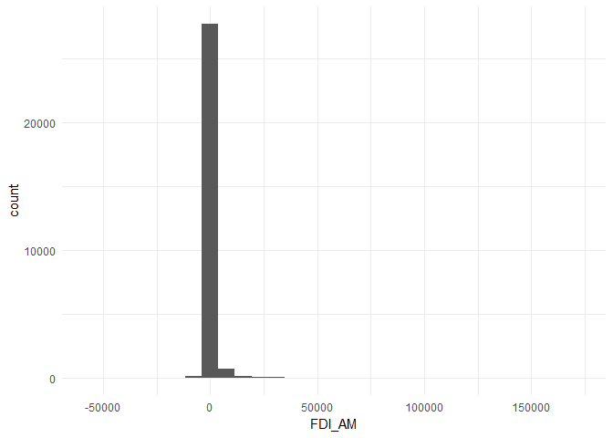

Plotting FDI flows
================

First, load the require packages.

``` r
library(tidyverse)
```

    ## -- Attaching packages ------------------------------------------------------------------------------ tidyverse 1.2.1 --

    ## v ggplot2 2.2.1     v purrr   0.2.4
    ## v tibble  1.4.2     v dplyr   0.7.4
    ## v tidyr   0.8.0     v stringr 1.3.0
    ## v readr   1.1.1     v forcats 0.3.0

    ## -- Conflicts --------------------------------------------------------------------------------- tidyverse_conflicts() --
    ## x dplyr::filter() masks stats::filter()
    ## x dplyr::lag()    masks stats::lag()

``` r
theme_set(theme_minimal())
```

Then, load the data set. Note that there is a brief description in the data folder.

``` r
fdi_data <- readRDS("data/fdi_minimum_data.rds")
glimpse(fdi_data)
```

    ## Observations: 92,783
    ## Variables: 5
    ## $ host   <chr> "AGO", "AGO", "AGO", "AGO", "AGO", "AGO", "AGO", "AGO",...
    ## $ source <chr> "ARG", "ARG", "ARG", "ARG", "ARG", "ARG", "ARG", "ARG",...
    ## $ year   <dbl> 1993, 1994, 1995, 1996, 1997, 1998, 1999, 2000, 2001, 2...
    ## $ dyad   <chr> "AGO_ARG", "AGO_ARG", "AGO_ARG", "AGO_ARG", "AGO_ARG", ...
    ## $ FDI_AM <dbl> NA, NA, NA, NA, NA, NA, NA, NA, NA, NA, NA, NA, NA, NA,...

``` r
summary(fdi_data$FDI_AM)
```

    ##      Min.   1st Qu.    Median      Mean   3rd Qu.      Max.      NA's 
    ## -51212.00      0.96     17.75    554.38    181.16 172123.87     63911

``` r
fdi_data <- fdi_data %>% 
  mutate(n_total = n(),
         flow_category = case_when(FDI_AM < 0  ~ "negative",
                                   FDI_AM > 0  ~ "positive",
                                   FDI_AM == 0 ~ "zero",
                                   TRUE        ~ "missing"))

fdi_data %>% 
  group_by(flow_category) %>%
  summarize(count = n(), proportion = count/unique(n_total))
```

    ## # A tibble: 4 x 3
    ##   flow_category count proportion
    ##   <chr>         <int>      <dbl>
    ## 1 missing       63911    0.689  
    ## 2 negative       6090    0.0656 
    ## 3 positive      22688    0.245  
    ## 4 zero             94    0.00101

Pooled data
===========

Raw FDI flows
-------------

In this plot all 63,911 missing values are ignored.

``` r
ggplot(fdi_data, aes(x = FDI_AM)) +
  geom_histogram()
```

    ## `stat_bin()` using `bins = 30`. Pick better value with `binwidth`.

    ## Warning: Removed 63911 rows containing non-finite values (stat_bin).



Logged FDI flows
----------------

Here, missing values and zero flows are ignored. We use two transformations. Positive flows are simply transformed by taking the natural logarithm. Negative flows are transformed as −ln(−FDI\_AM). Using these transformations it is necessary to model positive and negative flows separately to get reasonable estimates. Although this should be obvious, the next plot makes this clear even more: Due to the different transformations it is not clear, if the original FDI flow was positive or negative, since flows that are within the interval ( − 1, 1) on the original scale are transformed ambiguously. Another feature that becomes visible in the plot is multimodality. Especially at 0, to which both all flows with absolute value of 1 are mapped to. This is a first hint of measurement error. FDI flows that are exactly equal to 1 or -1 are reported more often than value in the neighborhood of these value. This is most likely due to rounding in the officially reported numbers. The pattern becomes even more apparent in later visualizations.

``` r
fdi_data <- fdi_data %>% 
  mutate(fdi_ln_mil = if_else(FDI_AM < 0, -log(-FDI_AM), log(FDI_AM)))
```

    ## Warning in log(-FDI_AM): NaNs produced

    ## Warning in log(FDI_AM): NaNs produced

``` r
ggplot(fdi_data, aes(x = fdi_ln_mil, fill = flow_category)) +
  geom_histogram(bins = 150)
```

    ## Warning: Removed 64005 rows containing non-finite values (stat_bin).


The multimodality issue becomes even more obvious when we employ the same transformation as before to FDI flows measured in USD (and *not* millions of USD). The overlap of the distributions is gone since none of the reported FDI flows are less than a Dollar in magnitude. More specifically, absolute flows below USD 22,000 (ln(22000)≈10) are almost never reported, which seems plausible. This gap however suggests, that negative and positive FDI flows should be either modeled separately or with some form of mixture model to take care of the multimodality. The measurement error problem even becomes more visible. The vertical dotted lines indicate flows of magnitude 1, 2, and 3 million USD. Both negative and positive reported flows gravitate towards these values. This is problematic, because if the problem is not addressed, the variability of low magnitude FDI flows will be underestimated.

``` r
fdi_data <- fdi_data %>% 
  mutate(fdi_ln = if_else(FDI_AM < 0, -log(-FDI_AM*1e6), log(FDI_AM*1e6)))
```

    ## Warning in log(-FDI_AM * 1e+06): NaNs produced

    ## Warning in log(FDI_AM * 1e+06): NaNs produced

``` r
vlines <- log((1:3)*1e6) * c(-1, -1, -1, 1, 1, 1)

ggplot(fdi_data, aes(x = fdi_ln, fill = flow_category)) +
  geom_histogram(bins = 150) + 
  geom_vline(xintercept = vlines, linetype = "dotted")
```

    ## Warning: Removed 64005 rows containing non-finite values (stat_bin).


Measurement error
-----------------

Focusing only on the magnitude of flows (in million USD here) after the log transformation described above and plotting more bins in of the histogram, reveals the most problematic values. Vertical dotted lines are draw at the transformed values of exactly 1, 2, 3, 4, 5, 10, and 20 million USD flows. These seem the values that disproportionately many reported numbers converge to.

``` r
fdi_data %>%
  mutate(fdi_ln_mil = if_else(flow_category == "negative", -fdi_ln_mil, fdi_ln_mil)) %>%
  ggplot(aes(x = fdi_ln_mil)) +
    geom_histogram(bins = 400) + 
  geom_vline(xintercept = log(c(1:5, 10, 20)), linetype = "dotted")
```

    ## Warning: Removed 64005 rows containing non-finite values (stat_bin).


In the following plot, the x-axis of the previous plot is cut in 50 equally spaced intervals and for each interval the standard deviation of the log of millions of absolute FDI flows is presented. The size of the dots represents the number of observations in that interval---intervals with fewer observations should show more variability in the the estimated standard deviation, which is the case. Larger dots should gravitate closer to a common standard deviation. This is also true, except for the intervals obtaining problematic values, which show much lower *"local"* standard deviations.

``` r
fdi_data %>%
    mutate(fdi_ln_mil = if_else(flow_category == "negative", -fdi_ln_mil, fdi_ln_mil)) %>% filter(fdi_ln_mil > -5) %>%
    mutate(cuts = cut_interval(fdi_ln_mil, 50)) %>% group_by(cuts) %>% summarize(local_sd = sd(fdi_ln_mil), n_obs = n()) %>% ggplot(aes(y = cuts, x = local_sd, size = n_obs)) + geom_point()
```

    ## Warning: Removed 1 rows containing missing values (geom_point).


If the number of cuts is increased so that arbitrariness of individual cuts does not matter as much, the pattern becomes even more pronounced.

``` r
fdi_data %>%
  mutate(fdi_ln_mil = if_else(flow_category == "negative", -fdi_ln_mil, fdi_ln_mil)) %>% 
  filter(fdi_ln_mil > -5) %>%
  mutate(cuts = cut_interval(fdi_ln_mil, 1000)) %>%
  group_by(cuts) %>% summarize(local_sd = sd(fdi_ln_mil), n_obs = n()) %>% 
  ungroup() %>% mutate(rank_cut = 1:length(cuts)) %>%
  ggplot(aes(y = rank_cut, x = local_sd, size = n_obs)) + geom_point()
```

    ## Warning: Removed 61 rows containing missing values (geom_point).


``` r
full <- fdi_data %>%
  filter(!is.na(fdi_ln_mil) & fdi_ln_mil != -Inf) %>%
  mutate(fdi_ln_mil = if_else(flow_category == "negative", -fdi_ln_mil, fdi_ln_mil),
         fdi_ln_mil_c = as.numeric(scale(fdi_ln_mil)),
         min_val = min(fdi_ln_mil_c), 
         max_val = max(fdi_ln_mil_c),
         cuts = cut(fdi_ln_mil_c, 
                    breaks = seq(unique(min_val), unique(max_val), length.out = 1500), 
                    include.lowest = TRUE)) %>%
    group_by(cuts) %>% 
    summarize(local_sd = sd(fdi_ln_mil_c), n_obs = n()) %>% 
    ungroup() %>% mutate(rank_cut = 1:length(cuts)) %>%
    mutate(selected = "full")

selected <- fdi_data %>%
  filter(!is.na(fdi_ln_mil) & fdi_ln_mil != -Inf) %>%
  mutate(fdi_ln_mil = if_else(flow_category == "negative", -fdi_ln_mil, fdi_ln_mil),
         fdi_ln_mil_c = as.numeric(scale(fdi_ln_mil)),
         min_val = min(fdi_ln_mil_c), 
         max_val = max(fdi_ln_mil_c),
         cuts = cut(fdi_ln_mil_c, 
                    breaks = seq(unique(min_val), unique(max_val), length.out = 1500), 
                    include.lowest = TRUE)) %>%
    filter(!(abs(FDI_AM) %in% c(1:20))) %>%
    group_by(cuts) %>% 
    summarize(local_sd = sd(fdi_ln_mil_c), n_obs = n()) %>% 
    ungroup() %>% mutate(rank_cut = 1:length(cuts)) %>%
    mutate(selected = "selected")

bind_rows(full, selected) %>% 
 ggplot(aes(y = rank_cut, x = local_sd, color = selected, size = n_obs)) + geom_point()
```

    ## Warning: Removed 92 rows containing missing values (geom_point).


For comparison, I did the same thin with 30,000 values from a standard normal distribution. *(Note that the size of the dots is not directly comparable with the previous plot, since the point here are much more evenly spread across the intervals!)*

``` r
tibble(x = rnorm(30000), cuts = cut_interval(x, 1000)) %>%
  group_by(cuts) %>% 
  summarize(local_sd = sd(x), n_obs = n()) %>%
  ungroup() %>% mutate(rank_cut = 1:length(cuts)) %>%
  ggplot(aes(x = local_sd, y = rank_cut, size = n_obs)) + geom_point()
```

    ## Warning: Removed 83 rows containing missing values (geom_point).


The inverse hyperbolic sine (IHS) transformation of FDI flows
-------------------------------------------------------------

The advantage of the IHS transformation is, that unlike the log transformation it is applicable to zero and negative values. The IHS transformation of bilateral FDI flows in million USD is shown below. Again, clustering around low integer values due to rounding of the reported data is visible. More importantly, the multimodality of the data becomes apparent as well.

``` r
fdi_data <- fdi_data %>%
  mutate(fdi_ihs_mil = asinh(FDI_AM))

ggplot(fdi_data, aes(x = fdi_ihs_mil)) +
  geom_histogram(bins = 100)
```

    ## Warning: Removed 63911 rows containing non-finite values (stat_bin).


Employing the IHS transformation on FDI flow data in USD (and not millions of USD) magnifies the multimodality issue. Here we see that there are actually three modes: two for the negative and positive flows just as with the log transformation above and one mode at zero, because the IHS admits zero values.

``` r
fdi_data <- fdi_data %>%
  mutate(fdi_ihs = asinh(FDI_AM*1e6))

ggplot(fdi_data, aes(x = fdi_ihs)) +
  geom_histogram(bins = 150)
```

    ## Warning: Removed 63911 rows containing non-finite values (stat_bin).


Treating missing values as zero flows
-------------------------------------

The number of *truly* zero bilateral FDI flows in the data set is surprisingly low (`94` observations). The majority of data on bilateral FDI flows is missing (`63911` observations). Usually this data is missing because it is too small to be reported, i.e. it is the FDI flow between the two countries is essentially zero. Therefore, missing data is often treated as effectively zero FDI flow. Using the IHS transformation on FDI flows in USD (and not in millions of USD) and setting missing values as zero, the above plot becomes:

``` r
fdi_data <- fdi_data %>%
  mutate(FDI_AM = if_else(is.na(FDI_AM), 0, FDI_AM),
         fdi_ihs = asinh(FDI_AM*1e6))

ggplot(fdi_data, aes(x = fdi_ihs)) +
  geom_histogram(bins = 150)
```


It is probably save to assume that most of the missing values in bilateral FDI flows are essentially zero, with absolute FDI flows somewhere below USD 10,000. Since the number of truly zero values in the data is extremely low in comparison to the number of missing values it is reasonable to treat these observations alike. However, this disguises true missing data as zero flows and severely increases the multimodality problem. These issues make a strong case for modeling zero/missing flows separately from positive/negative flows.

Outliers
--------

The various data transformations show that almost no flows below the absolute magnitude of USD 10,000 are ever reported. The following observations all fall below this threshold (excluding true zero observations). First one needs to check, if these observations are fine (some of these observations imply flows that are way below one cent). When modeling positive/negative flows separately might be reasonable to set these observations to zero.

``` r
fdi_data <- fdi_data %>% 
  mutate(outlier = if_else(!(flow_category %in% c("missing", "zero")) & between(FDI_AM, -0.01, 0.01), 
                           "yes", "no"))
fdi_data %>% filter(outlier == "yes") %>% 
  arrange(FDI_AM) %>%
  print(., n = 30)
```

    ## # A tibble: 26 x 12
    ##    host  source  year dyad        FDI_AM n_total flow_category fdi_ln_mil
    ##    <chr> <chr>  <dbl> <chr>        <dbl>   <int> <chr>              <dbl>
    ##  1 EST   ISL    1997. EST_ISL  -9.87e- 3   92783 negative            4.62
    ##  2 LKA   SWE    1982. LKA_SWE  -9.23e- 3   92783 negative            4.69
    ##  3 AUS   SWE    1993. AUS_SWE  -5.65e- 3   92783 negative            5.18
    ##  4 SVK   ISL    1999. ISL_SVK  -4.84e- 3   92783 negative            5.33
    ##  5 URY   KOR    1997. KOR_URY  -2.00e- 3   92783 negative            6.21
    ##  6 CHE   KOR    2000. CHE_KOR  -1.00e- 3   92783 negative            6.91
    ##  7 BWA   DEU    1988. BWA_DEU  -1.11e- 5   92783 negative           11.4 
    ##  8 CRI   DEU    1988. CRI_DEU  -1.11e- 5   92783 negative           11.4 
    ##  9 ETH   DEU    1988. DEU_ETH  -1.11e- 5   92783 negative           11.4 
    ## 10 TTO   DEU    1988. DEU_TTO  -1.11e- 5   92783 negative           11.4 
    ## 11 BWA   DEU    1989. BWA_DEU  -1.04e- 5   92783 negative           11.5 
    ## 12 MOZ   DEU    1989. DEU_MOZ  -1.04e- 5   92783 negative           11.5 
    ## 13 NER   DEU    1989. DEU_NER  -1.04e- 5   92783 negative           11.5 
    ## 14 ESP   USA    1995. ESP_USA -10.00e- 6   92783 negative           11.5 
    ## 15 SWE   USA    1995. SWE_USA -10.00e- 6   92783 negative           11.5 
    ## 16 IRL   GBR    1999. GBR_IRL  -7.11e-14   92783 negative           30.3 
    ## 17 SWE   GBR    1999. GBR_SWE  -6.13e-14   92783 negative           30.4 
    ## 18 IDN   DEU    2000. DEU_IDN   8.88e-16   92783 positive          -34.7 
    ## 19 NZL   TWN    1991. NZL_TWN   1.00e- 3   92783 positive           -6.91
    ## 20 SVK   ISL    1994. ISL_SVK   3.55e- 3   92783 positive           -5.64
    ## 21 NOR   KOR    1992. KOR_NOR   4.00e- 3   92783 positive           -5.52
    ## 22 AUS   TWN    1985. AUS_TWN   7.00e- 3   92783 positive           -4.96
    ## 23 DNK   ISL    1995. DNK_ISL   7.30e- 3   92783 positive           -4.92
    ## 24 SVK   ISL    1998. ISL_SVK   8.17e- 3   92783 positive           -4.81
    ## 25 PAK   KOR    1999. KOR_PAK   9.00e- 3   92783 positive           -4.71
    ## 26 SVK   ISL    1992. ISL_SVK   9.35e- 3   92783 positive           -4.67
    ## # ... with 4 more variables: fdi_ln <dbl>, fdi_ihs_mil <dbl>,
    ## #   fdi_ihs <dbl>, outlier <chr>

Conclusion
----------

Some transformation of the FDI flow data is needed. Log transformation and IHS transformation both work fine, especially in the case when the original values are very large, i.e. when FDI is measured in USD and not millions of USD. In this scenario both transformations are almost equivalent and lead to an approximate normal distribution. The visual analysis conducted here shows, that two problems remain: Multimodality and measurement error.

Most of the measurement error most likely stems from the fact that official FDI flow statistics (in million USD) are rounded to the nearest integer value. This is problematic, because the reported data for FDI flows of low magnitude is less variable then the actual (unobserved or unreported) values. The problem might not be as severe if FDI flows are taken as dependent variable and not as independent. **\[needs to be checked; problem: independent variables that correlate more strongly with low FDI flows?\]**

**\[Multimodality (correlated random effects)\]**

Cross-section data
==================

tba

Time-series data
================

tba

TSCS data
=========

tba
